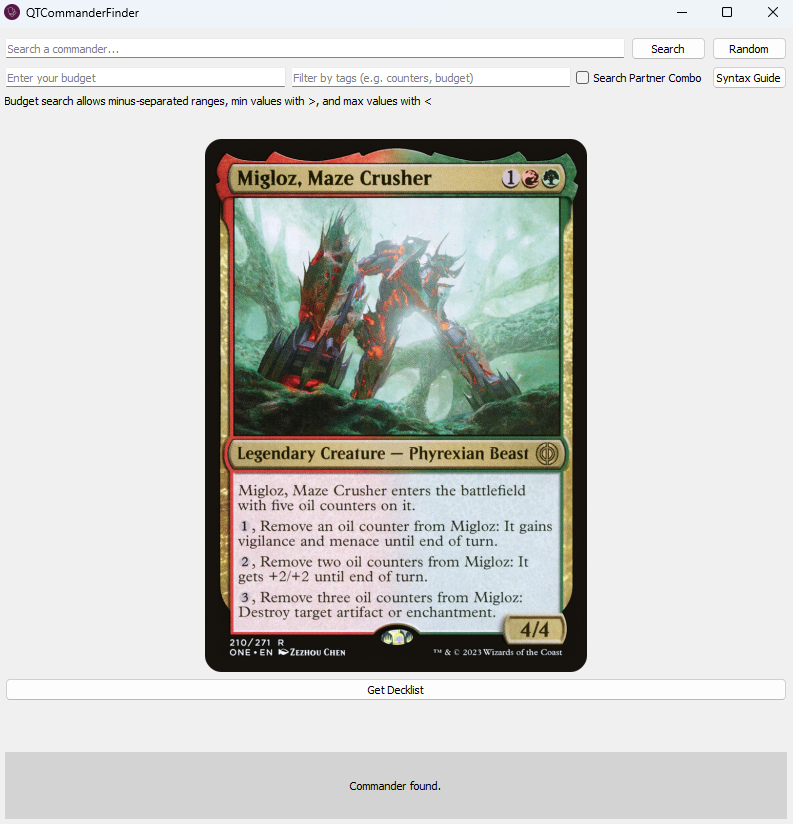

# MTG Commander Budget Deck Finder

A simple desktop application built with PyQt5 to help Magic: The Gathering players find budget-friendly Commander/EDH decklists.

This tool automates the process of finding a commander, looking up budget decks on EDHRec, and exporting a text-based list for use in online simulators or deckbuilding tools.



---

## Features

- **Commander Search**: Find any legal commander using the full [Scryfall Search Syntax](https://scryfall.com/docs/syntax).
- **Image Display**: Fetches and displays the commander's card image.
- **Budget Filtering**: Finds decklists on EDHRec and filters them based on a user-defined maximum price.
- **Automated Scraping**: Uses Selenium with `selenium-stealth` to reliably scrape decklists from popular hosting sites like Moxfield and Archidekt, bypassing bot detection.
- **Direct-to-Clipboard**: Copies the final, formatted decklist directly to your clipboard.

## How It Works

1.  **Search**: You enter a commander's name. The app queries the Scryfall API to find the card and its EDHRec page.
2.  **Fetch Decks**: It navigates to the commander's EDHRec page and parses the embedded JSON data to find recent decklists.
3.  **Filter**: It filters the found decks by the budget you specified.
4.  **Scrape**: It takes the link to the first matching deck (e.g., on Moxfield or Archidekt) and launches a background Selenium process. `selenium-stealth` is used to avoid being blocked by services like Cloudflare.
5.  **Extract**: The background worker either parses the embedded page data (for Archidekt) or simulates clicks (for Moxfield) to get to the text export.
6.  **Copy**: The final decklist is sent back to the main application and copied to your clipboard.

## Setup and Installation

This project requires Python 3 and a working installation of Google Chrome.

1.  **Clone the repository:**
    ```sh
    git clone <your-repository-url>
    cd <your-repository-directory>
    ```

2.  **Create a virtual environment (recommended):**
    ```sh
    python -m venv venv
    # On Windows
    venv\Scripts\activate
    # On macOS/Linux
    source venv/bin/activate
    ```

3.  **Install the required packages:**
    Create a `requirements.txt` file with the following content:
    ```
    PyQt5
    requests
    beautifulsoup4
    selenium
    selenium-stealth
    pyperclip
    ```
    Then, install them:
    ```sh
    pip install -r requirements.txt
    ```

4.  **Run the application:**
    ```sh
    python qtcommanderfinder.py
    ```

## Disclaimer

This tool relies on web scraping from third-party websites (Scryfall, EDHRec, Moxfield, Archidekt). The structure of these websites may change at any time, which could cause the scraping logic to fail. If you encounter issues, the selectors in the `DecklistScraperWorker` class may need to be updated.

## A Note on Responsible Scraping

This tool is intended for personal, educational use. It is designed to make a limited number of targeted requests and not to overload the servers of the websites it interacts with.

- It uses a realistic `User-Agent` header.
- It does not perform rapid, repeated requests.
- It respects the data structures provided by the sites (e.g., `__NEXT_DATA__`) where possible, as this is more efficient and less intrusive than UI interaction.

Please use this tool responsibly.

## Credits

Window icon found at [Flaticon](https://www.flaticon.com/free-icons/flash-cards) and was created by manshagraphics